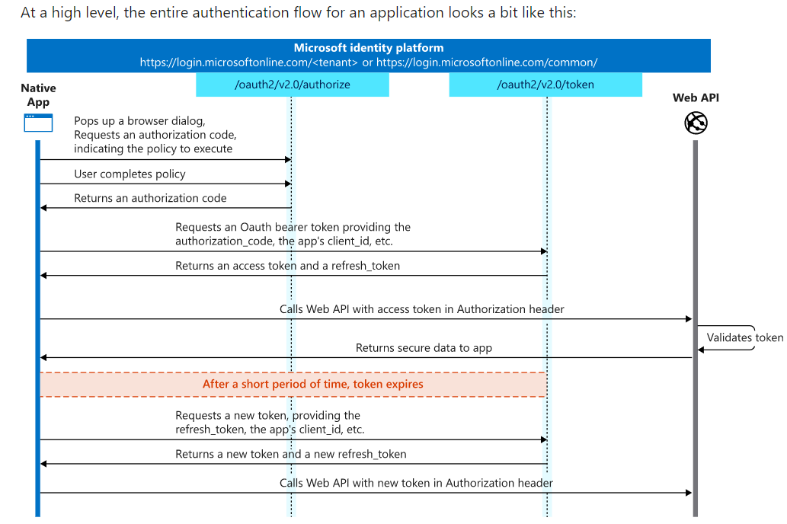

# Stock price tracker
<mark>Using the unofficial yfinance API
this just requests the quote in the format yahoofinance gives, and runs a web crawler
https://algotrading101.com/learn/yfinance-guide/ 
https://pypi.org/project/yfinance/ 
https://algotrading101.com/learn/yfinance-guide/ 
https://github.com/ranaroussi/yfinance 
	**SUCCESS!**</mark>
https://towardsdatascience.com/the-unofficial-yahoo-finance-api-32dcf5d53df –> alternatively the yahooquery api which can more reliably extract financial statements. (income_statement, balance_sheet and cash_flow)
	https://stackoverflow.com/questions/22086116/how-do-you-filter-pandas-dataframes-by-multiple-columns –> I will probably want to filter out the results by using pandas dataframe manipulation. If not they return me a long table.
# Modifying excel with python
<mark>**openpyxl**</mark>
# Managing data with a RDBMS instead.
## notes on ideal db structure:
1. historical
https://softwareengineering.stackexchange.com/questions/276395/two-database-architecture-operational-and-historical 
https://stackoverflow.com/questions/3874199/how-to-store-historical-data 
## import excel to RDB 
<mark>https://medium.com/@AviGoom/how-to-import-a-csv-file-into-a-mysql-database-ef8860878a68 
**DONE**</mark>
1. How to batch edit data in some columns? Try this
   1. first use if else statements and save in a new column 
   2. learn to splice string from back
   3. then after replace original column with new column and delete new column 
## Modifying with MySQL via Python
# Googlemaps
https://github.com/googlemaps/google-maps-services-python 
# Web scraper
Web page extractor
https://urllib3.readthedocs.io/en/latest/reference/urllib3.request.html
https://docs.python.org/3/library/urllib.parse.html#module-urllib.parse 
https://docs.python.org/3/howto/urllib2.html
[regular Web Scraper (maybe for financials and news feed)](https://realpython.com/beautiful-soup-web-scraper-python/)

[some app you can make 250,000 requests for free.](https://aroussi.com/post/tradologics-the-future-of-trading)

[webscraping login websites with python](https://towardsdatascience.com/scraping-data-behind-site-logins-with-python-ee0676f523ee)
## form filling
https://learn.onemonth.com/automate-web-forms-with-python/ 
# pull financial statements
[some free tools this ex banker uses.](https://www.toptal.com/finance/freelance/bloomberg-terminal-alternative) 
# automate reading PDFs
PDF to excel API
http://pdfextractoronline.com/pdf-to-excel-api/ 
https://towardsdatascience.com/extracting-data-from-financial-pdfs-dc2fa0b73169 
1. first an algo attempts to create bounding boxes around things it thinks is text
2. then another algo does OCR to detect characters
3. lastly an algo tries to understand if the detected text is organised as a table or free-form text.
# machine learning
[running tensorflow with your GPU. Tensorflow-gpu](https://towardsdatascience.com/how-to-traine-tensorflow-models-79426dabd304)
Machine learn on market 
machine learning and RDBs 
[data preperation using MySQL](https://blog.bigml.com/2013/10/30/data-preparation-for-machine-learning-using-mysql/)
https://docs.mindsdb.com/tutorials/microsoft-sql-server/?utm_medium=display&utm_source=google&utm_campaign=mssql&gclid=CjwKCAiAkJKCBhAyEiwAKQBCkhbaqhiXBgoa7_O7fPiJES4dxmix3pb-RsOoba1IcQd60l_KYOWUfBoClIMQAvD_BwE 

# ai analyst
An ai which knows NLP, can be trained on market data and I can discuss stock ideas with it.
1. Pull historical financials 
2. translate to fcf
3. Project segments
	1. knows market growth and market share
	2. It should be able to do SOTP. Each segment it can try DCF, asset-based, or multiple approach.
4. obtain appropriate multiple for industry. You should be using the exit multiple approach, perpetuity just doesn’t make sense.
5. Obtain target price
6. Probabilistic outcome (report actionables: buy this now, do nothing, sell)
	1. “there will be quite a few stocks that will be up 100% by end of the year, you just need to pick a few of them”
	2. 25% below target price and more, buy. Target price, sell half. 25% above target price, sell all.
7. I can say “lets try fining the company”, “lets say a disruptor happens”
https://www.business-science.io/finance/2020/02/21/tidy-discounted-cash-flow.html –> DCF using R
1. lets do this but with Python
	1. Step 1: tabula-py, extracts table from pdf to python dataframe
	2. not only that but also would be good to have macro data (interest rates are particularly useful as it helps determine cost of debt)
# Algotrading

Thus it is good that I’m learning options using their platform, familiarises with their tools. When migrating to algo trading (quick note: I think best to use limited upside and downside strats when algo trading, if not will quickly snowball), I can quickly integrate the 2 worlds. 

Algo for income! Just keep doing iron condors. 1 month rolling everyweek. Look, S&P doesn’t fluctuate more than 10% a month. 

Algo can also be used to automate closing strategies, these help close positions quickly.
	1. however, I am worried about volume, strike prices far out have low vol and hence liquidity.
https://github.com/quantopian/zipline 

## Interactive Brokers (IBKR) API
Might be good, can trade sg and hk markets (certain shares can).
https://algotrading101.com/learn/interactive-brokers-python-api-native-guide/ 
http://interactivebrokers.github.io/tws-api/order_submission.html 
Can use this, if TD Ameritrade proves unusable
https://www.youtube.com/watch?v=-UdWguw90g4 ← haha nice

## TD Ameritrade APIs
https://developer.tdameritrade.com/content/getting-started –> TD Ameritrade API.
https://pypi.org/project/td-ameritrade-python-api/ 
The sales tells me there’s a 6+ week wait time. Shag.
1. accounts and trading
	1. create an account to obtain the Consumer Key or client_id
	2. Also get the OAuth User ID
		1. when I used the testing browser page, it pulled this: P7N1B5FEY6HFBIMTFYBC0SHMAWPX9DX5. Is this my perma OAuth token?
			1. <mark>No this is just your client ID. You still nid your bearer access token.</mark>
	3. Access token: https://developer.tdameritrade.com/authentication/apis/post/token-0: get an access token. And also to supply the “resource URL” which will specify your accountId.
		1. That link will help you get. They have 2 types. “Refresh token” and “authorization code”.
			1. https://docs.microsoft.com/en-us/azure/active-directory/develop/v2-oauth2-auth-code-flow#:~:text=The%20OAuth%202.0%20authorization%20code%20flow%20is%20described%20in%20section,apps%2C%20and%20natively%20installed%20apps. 
			2. 
		2. Response type: code, token, id_token and combinations of each. https://openid.net/specs/oauth-v2-multiple-response-types-1_0.html 
		3. <mark>What is “URL Decoded Auth Code”??? (this is for the “code” field in the API reference website). Use a URL Decoder to decode the response you get. </mark>
		4. How to get refresh token.
			1. Yes it expires after 30min.
			2. The python lib by alex reed does it automatically :)
	4. <mark>I had to open localhost to the web.</mark>
		1. <mark>Control Panel > Programs > Turn Windows features on or Off > Check on “Internet information Services” and “Internet information Services Hostable Web core” </mark>
	5. When doing this authenticaiton with a local app. Follow this: https://developer.tdameritrade.com/content/simple-auth-local-apps 
		1. make the app call the “authentication” URL there.

2. You can use the SG account with it. Separately you need to create a developer account.
3. Redirect URI? Consumer key?
	1. Consumer key is created once your TD Ameritrade app is successfully registered. It is also known as the client_id
	2. Redirect URI – for now I just put 127.0.0.1 (localhost)
4. Calling from python script: flask or django
	1. https://www.youtube.com/watch?v=jpWZyd4fU7c → python program that makes HTTP requests to TD ameritrade’s API.
   
https://tlc.thinkorswim.com/center/reference/thinkScript → thinkScript.
	ThinkScript is not an API, just a language that you use in their platform.

## Tiger Brokers API
https://quant.itiger.com/openapi/py-docs/zh-cn/docs/intro/framework.html#method 
https://quant.itiger.com/openapi/py-docs/zh-cn/docs/intro/quickstart.html 
actually don’t think its very comprehensive.. they have scraps of code here and there